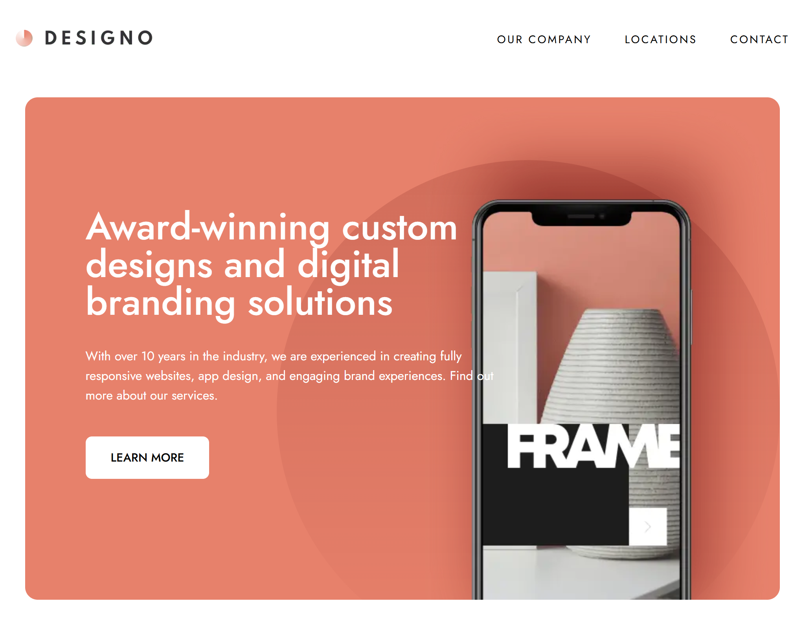

# Designo - Multi-Page Agency Website
Designo is a modern, responsive, multi-page agency website built to showcase digital branding solutions, custom web design, app design, and graphic design projects.

## ✨ Features

- **Multi-Page Navigation:** Seamless client-side routing across Home, Design Category pages (Web, App, Graphic), About Us, Locations, and Contact pages.
- **Interactive Map / Locations View:** Interactive visualization for office locations (Canada, Australia, United Kingdom).
- **Form Validation:** Real-time feedback and validation on the contact form to ensure required fields are completed properly.
- **Responsive Layout:** Mobile-first approach designed to render fluidly across mobile, tablet, and desktop viewports.

## 🛠️ Tech Stack

- **Framework:** Next.js / React
- **Styling:** Tailwind CSS / CSS Modules
- **Language:** TypeScript / JavaScript
- **Icons & Assets:** Custom SVG illustrations and vector graphic patterns
